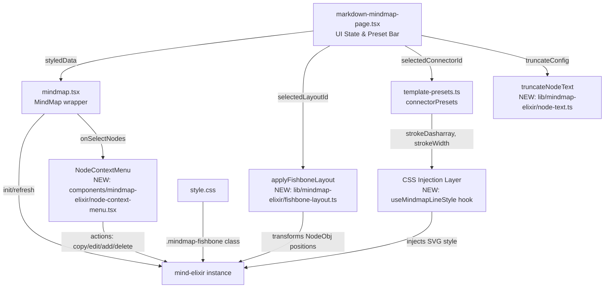
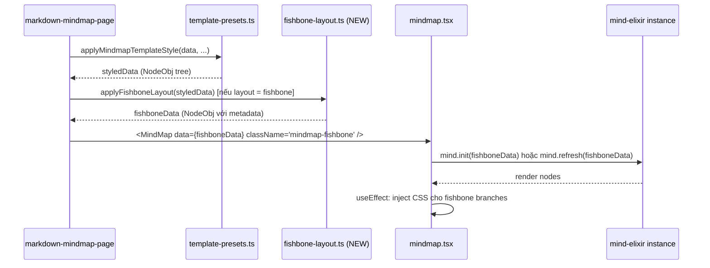
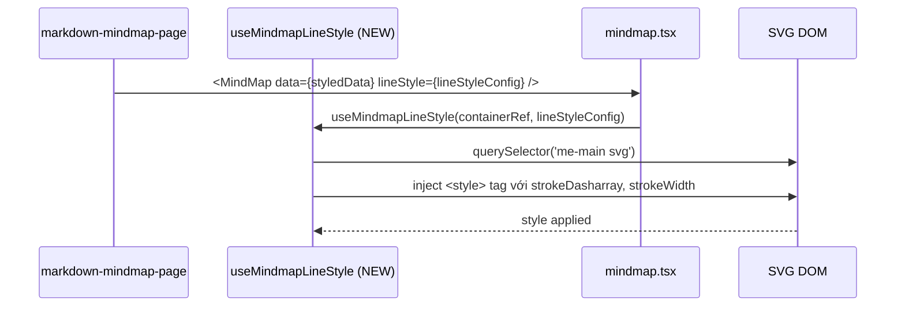
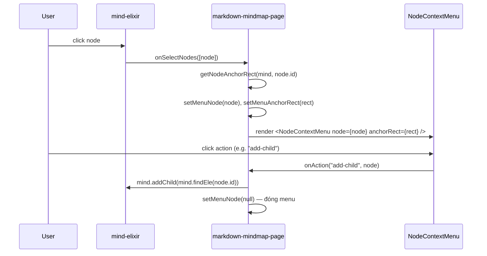

# Tài liệu Thiết kế: Mindmap Elixir v2

## Tổng quan

Mindmap Elixir v2 cải tiến **năm nhóm tính năng** trên nền codebase hiện tại (`mind-elixir ^5.11.0`):

1. **Fishbone Layout thực sự** — layout dạng xương cá (Ishikawa) với trục ngang (spine) và các nhánh nghiêng lên/xuống theo góc cố định, thay vì dùng bidirectional thông thường như hiện tại.
2. **Line style tùy chỉnh** — hỗ trợ `strokeDasharray` (dashed/dotted) và `strokeWidth` per-connector thông qua CSS injection vào SVG của mind-elixir.
3. **Connection point fix** — đường kết nối nối vào cạnh bên (left/right) của node thay vì bottom, bằng cách override CSS `--main-gap-y` và dùng `alignment: "nodes"` kết hợp với CSS transform.
4. **Node text truncation** — xử lý text siêu dài trong node: clamp theo `maxChars`, hiển thị tooltip khi hover, và cho phép cấu hình per-preset.
5. **Node context menu** — click vào node mở floating menu với các action: Copy text, Edit, Add child, Add sibling, Change color, Delete.

---

## Kiến trúc tổng thể



---

## Phân tích vấn đề hiện tại

### Vấn đề 1: Fishbone layout

mind-elixir không có API layout tùy chỉnh — nó tự tính toán vị trí node dựa trên `direction` (0/1/2) và CSS vars `--node-gap-x/y`. Để tạo fishbone thực sự cần:

- **Spine ngang**: root node ở giữa, các main branch trải dọc theo trục X
- **Branches nghiêng**: các nhánh cấp 1 nghiêng ~45° lên (bên trái) và xuống (bên phải)
- **Sub-branches**: các nhánh cấp 2+ song song với spine

Giải pháp: dùng `direction: 1` (horizontal tree) + CSS transform trên `me-wrapper` để xoay các nhánh, kết hợp với class `.mindmap-fishbone` inject vào container.

### Vấn đề 2: Dashed/dotted line

`MindmapConnectorPreset.arrowStyle` đã có `strokeDasharray` (thấy trong preset `two-way`), nhưng `strokeDasharray` chỉ áp dụng cho `arrows` overlay — không áp dụng cho SVG path chính của mind-elixir (các đường kết nối giữa nodes).

Giải pháp: inject `<style>` tag vào container SVG với selector `me-main svg path, me-main svg polyline` để override stroke properties.

### Vấn đề 3: Connection point

mind-elixir mặc định nối đường từ bottom-center của node cha xuống top-center của node con (khi `direction: 1`). Với `direction: 2` (bidirectional), nó nối từ right/left edge nhưng vẫn có offset vertical.

Giải pháp: CSS override `me-tpc` với `vertical-align: middle` và điều chỉnh `--main-gap-y: 0` cho fishbone, kết hợp với `alignment: "nodes"` (đã có trong mindmap.tsx).

---

## Kiến trúc chi tiết các thay đổi

### Sơ đồ sequence: Fishbone rendering



### Sơ đồ sequence: Line style injection



---

## Components và Interfaces

### 1. Mở rộng `MindmapConnectorPreset` (template-presets.ts)

**Mục đích**: Thêm các thuộc tính line style mới vào connector preset.

```typescript
export type MindmapConnectorPreset = {
  id: string;
  name: string;
  mainLinkStyle: number;
  branchColors?: string[];
  arrowMode?: "none" | "primary" | "sequence" | "bidirectional";
  arrowStyle?: MindmapArrowStyle;
  // THÊM MỚI v2:
  lineStyle?: {
    strokeDasharray?: string;   // "6 3" | "2 4" | "8 4 2 4" | undefined (solid)
    strokeWidth?: number;       // 1 | 1.5 | 2 | 2.5 | 3 (default: từ theme)
    strokeLinecap?: "round" | "square" | "butt";
    opacity?: number;           // 0–1
  };
};
```

**Trách nhiệm**:
- Lưu trữ cấu hình visual cho đường kết nối chính (không phải arrow overlay)
- `lineStyle` được đọc bởi `useMindmapLineStyle` hook để inject CSS

### 2. Module mới: `fishbone-layout.ts` (lib/mindmap-elixir/)

**Mục đích**: Transform `MindElixirData` để chuẩn bị cho fishbone rendering.

```typescript
export type FishboneConfig = {
  spineAngle: number;        // Góc nghiêng của nhánh cấp 1 (mặc định: 45)
  alternating: boolean;      // Nhánh xen kẽ lên/xuống (mặc định: true)
  spineNodeId?: string;      // ID của node làm spine (mặc định: root)
};

export function applyFishboneLayout(
  data: MindElixirData,
  config?: Partial<FishboneConfig>
): MindElixirData;

export function isFishboneLayout(layoutId: string): boolean;
```

**Trách nhiệm**:
- Thêm metadata vào `NodeObj.style` để CSS có thể target từng nhánh
- Đặt `direction: 1` (horizontal) cho mind-elixir
- Gán class marker vào node style để CSS fishbone hook vào

### 3. Hook mới: `useMindmapLineStyle` (components/ui/ hoặc lib/mindmap-elixir/)

**Mục đích**: Inject CSS style vào SVG paths của mind-elixir dựa trên `lineStyle` config.

```typescript
export function useMindmapLineStyle(
  containerRef: React.RefObject<HTMLDivElement>,
  lineStyle: MindmapConnectorPreset["lineStyle"] | undefined,
  isLoaded: boolean,
): void;
```

**Trách nhiệm**:
- Watch `lineStyle` và `isLoaded`
- Inject/update `<style id="me-line-style-override">` vào container
- Cleanup khi unmount hoặc lineStyle thay đổi

### 4. Mở rộng `MindmapLayoutPreset` (template-presets.ts)

```typescript
export type MindmapLayoutPreset = {
  id: string;
  name: string;
  category: "Tree" | "Map" | "Orbit" | "Diagram"; // THÊM "Diagram"
  direction: MindmapDirection;
  description: string;
  shapeId?: string;
  densityId?: string;
  connectorId?: string;
  geometryId?: string;
  maxExpandedDepth?: number;
  // THÊM MỚI v2:
  layoutEngine?: "default" | "fishbone"; // Engine xử lý layout
  fishboneConfig?: FishboneConfig;       // Config cho fishbone engine
};
```

### 5. Mở rộng `MindMap` component props (mindmap.tsx)

```typescript
interface MindMapProps {
  // ... props hiện tại ...
  // THÊM MỚI v2:
  lineStyle?: MindmapConnectorPreset["lineStyle"];
  fishbone?: boolean; // Kích hoạt CSS class mindmap-fishbone
  truncateConfig?: NodeTruncateConfig; // Cấu hình text truncation
  nodeMenuItems?: NodeMenuItem[];      // Custom menu items cho node context menu
  onNodeMenuAction?: (action: NodeMenuAction, node: NodeObj) => void;
}
```

### 6. Module mới: `node-text.ts` (lib/mindmap-elixir/)

**Mục đích**: Xử lý text truncation cho node có text siêu dài.

```typescript
export type NodeTruncateConfig = {
  maxChars: number;          // Số ký tự tối đa trước khi truncate (mặc định: 40)
  maxLines?: number;         // Số dòng tối đa (mặc định: 2)
  ellipsis?: string;         // Ký tự thay thế (mặc định: "…")
  preserveWords?: boolean;   // Không cắt giữa từ (mặc định: true)
};

// Truncate text cho một node topic
export function truncateNodeTopic(
  topic: string,
  config: NodeTruncateConfig,
): string;

// Áp dụng truncation cho toàn bộ cây node (trả về data mới, không mutation)
export function applyNodeTextTruncation(
  data: MindElixirData,
  config: NodeTruncateConfig,
): MindElixirData;

// Lưu full text vào node style để tooltip có thể đọc
// Convention: node.style["--full-topic"] = encodeURIComponent(originalTopic)
export function embedFullTopic(node: NodeObj, originalTopic: string): NodeObj;

// Đọc full text từ node style
export function extractFullTopic(node: NodeObj): string | null;
```

**Trách nhiệm**:
- Pure functions, không side effect
- `applyNodeTextTruncation` chạy trong `useMemo` ở `markdown-mindmap-page.tsx`, sau `applyMindmapTemplateStyle`
- Full text được embed vào `node.style` để `NodeDetailPanel` và tooltip có thể đọc

### 7. Component mới: `NodeContextMenu` (components/mindmap-elixir/)

**Mục đích**: Floating context menu xuất hiện khi user click vào node, cung cấp các action nhanh.

```typescript
export type NodeMenuAction =
  | "copy-text"
  | "edit"
  | "add-child"
  | "add-sibling-before"
  | "add-sibling-after"
  | "change-color"
  | "expand-all"
  | "collapse-all"
  | "delete";

export type NodeMenuItem = {
  action: NodeMenuAction;
  label: string;
  icon?: ReactNode;
  shortcut?: string;
  danger?: boolean;        // Hiển thị màu đỏ (dùng cho delete)
  disabled?: boolean;
};

export type NodeContextMenuProps = {
  node: NodeObj | null;           // null = menu đóng
  anchorRect: DOMRect | null;     // Vị trí của node element để định vị menu
  items: NodeMenuItem[];
  onAction: (action: NodeMenuAction, node: NodeObj) => void;
  onClose: () => void;
  isRoot?: boolean;               // Root node: disable delete, add-sibling
};

export function NodeContextMenu(props: NodeContextMenuProps): ReactNode;
```

**Trách nhiệm**:
- Render floating panel tại vị trí node (tính toán để không bị clip ra ngoài viewport)
- Đóng khi click outside, press Escape, hoặc sau khi thực hiện action
- Không phụ thuộc vào mind-elixir internals — nhận `anchorRect` từ ngoài
- Dùng `@headlessui/react` `Popover` hoặc custom implementation (không thêm dependency mới)

---

## Data Models

### Model: `FishboneNodeMeta` (embedded trong NodeObj.style)

mind-elixir không có field metadata riêng cho node ngoài `style` object. Ta dùng convention đặt prefix `data-` trong style để truyền metadata:

```typescript
// Không thêm field mới vào NodeObj — dùng style object với custom properties
// Ví dụ: node.style = { "--fishbone-branch-index": "0", "--fishbone-side": "top" }
// CSS sẽ đọc các custom properties này
```

**Validation Rules**:
- `--fishbone-branch-index`: số nguyên >= 0
- `--fishbone-side`: "top" | "bottom"
- Chỉ set trên nodes cấp 1 (main branches)

### Model: `LineStyleConfig`

```typescript
type LineStyleConfig = {
  strokeDasharray?: string;
  strokeWidth?: number;
  strokeLinecap?: "round" | "square" | "butt";
  opacity?: number;
};
```

**Validation Rules**:
- `strokeDasharray`: chuỗi số cách nhau bởi space, ví dụ `"6 3"`, `"2 4"`, `"8 4 2 4"`
- `strokeWidth`: 0.5–8 (px)
- `opacity`: 0–1

### Model: `NodeTruncateConfig`

```typescript
type NodeTruncateConfig = {
  maxChars: number;        // Mặc định: 40
  maxLines?: number;       // Mặc định: 2
  ellipsis?: string;       // Mặc định: "…"
  preserveWords?: boolean; // Mặc định: true
};
```

**Validation Rules**:
- `maxChars`: số nguyên dương, tối thiểu 10
- `maxLines`: số nguyên dương, tối thiểu 1
- `ellipsis`: chuỗi tối đa 3 ký tự
- Full text gốc được lưu vào `node.style["--full-topic"]` dưới dạng `encodeURIComponent(topic)`

### Model: `NodeMenuItem` / `NodeMenuAction`

```typescript
type NodeMenuAction =
  | "copy-text"
  | "edit"
  | "add-child"
  | "add-sibling-before"
  | "add-sibling-after"
  | "change-color"
  | "expand-all"
  | "collapse-all"
  | "delete";

type NodeMenuItem = {
  action: NodeMenuAction;
  label: string;
  icon?: ReactNode;
  shortcut?: string;
  danger?: boolean;
  disabled?: boolean;
};
```

**Default menu items** (dùng khi `nodeMenuItems` prop không được truyền):

| Action | Label | Icon | Shortcut | Danger | Disabled khi |
|---|---|---|---|---|---|
| `copy-text` | Copy text | `Copy` | `⌘C` | — | — |
| `edit` | Edit | `PenLine` | `F2` | — | readonly=true |
| `add-child` | Add child | `Plus` | `Tab` | — | readonly=true |
| `add-sibling-after` | Add sibling | `ListPlus` | `Enter` | — | readonly=true, isRoot |
| `expand-all` | Expand all | `Maximize2` | — | — | không có children |
| `collapse-all` | Collapse all | `Minimize2` | — | — | không có children |
| `change-color` | Change color | `Palette` | — | — | readonly=true |
| `delete` | Delete | `Trash2` | `Del` | ✓ | readonly=true, isRoot |

---

## Thiết kế chi tiết: Node Text Truncation

### Vấn đề gốc

mind-elixir render topic text trực tiếp vào `me-tpc` element. Khi text quá dài:
- Node bị giãn rộng, phá vỡ layout
- Các node khác bị đẩy lệch
- Không có cơ chế wrap/clamp tích hợp

### Cách tiếp cận

**Truncate tại data layer** (trước khi truyền vào mind-elixir), không dùng CSS `text-overflow` vì mind-elixir không expose width constraint API.

Pipeline:
```
markdownToMindElixir(source)
  → applyMindmapTemplateStyle(data, ...)
  → applyNodeTextTruncation(styledData, truncateConfig)   ← THÊM MỚI
  → <MindMap data={truncatedData} />
```

Full text gốc được lưu vào `node.style["--full-topic"]` để:
- `NodeDetailPanel` hiển thị full text
- Tooltip khi hover node hiển thị full text
- Export/copy lấy full text thay vì truncated text

### `truncateNodeTopic` function

```typescript
export function truncateNodeTopic(
  topic: string,
  config: NodeTruncateConfig,
): string {
  const { maxChars = 40, ellipsis = "…", preserveWords = true } = config;

  // Strip HTML tags trước khi đếm ký tự
  const plainText = topic.replace(/<[^>]*>/g, "");

  if (plainText.length <= maxChars) return topic;

  if (preserveWords) {
    // Cắt tại word boundary gần nhất trước maxChars
    const truncated = plainText.slice(0, maxChars);
    const lastSpace = truncated.lastIndexOf(" ");
    return (lastSpace > maxChars * 0.6 ? truncated.slice(0, lastSpace) : truncated) + ellipsis;
  }

  return plainText.slice(0, maxChars) + ellipsis;
}
```

### Tooltip khi hover

Dùng CSS `title` attribute — mind-elixir không block việc set attribute trên `me-tpc`. Ta inject `title` attribute sau khi mind-elixir render bằng `MutationObserver`:

```typescript
// Trong useMindmapLineStyle hoặc hook riêng useMindmapTooltips
// Watch me-tpc elements, set title = extractFullTopic(node) nếu có
```

**Lưu ý**: Đây là native browser tooltip — không cần custom tooltip component, KISS.

### Cấu hình per-preset

`MindmapDensityPreset` được mở rộng để carry truncate config:

```typescript
export type MindmapDensityPreset = {
  id: string;
  name: string;
  themeVars: Partial<Theme["cssVar"]>;
  nodeWidth?: string;
  fontScale: "compact" | "normal" | "large";
  // THÊM MỚI v2:
  truncateConfig?: NodeTruncateConfig;
};
```

Ví dụ: density `compact` → `maxChars: 25`, density `spacious` → `maxChars: 60`, density `cinematic` → `maxChars: 35`.

---

## Thiết kế chi tiết: Node Context Menu

### Vấn đề gốc

mind-elixir có built-in `contextMenu` option nhưng:
- Chỉ trigger trên right-click, không phải left-click
- UI không match design system của project
- Không thể customize items dễ dàng
- Không có keyboard shortcut hints

### Cách tiếp cận

**Tắt built-in contextMenu** (`contextMenu: false` trong options), thay bằng custom `NodeContextMenu` component được trigger từ `onSelectNodes` event.

**Trigger flow**:
1. User click node → mind-elixir fire `selectNodes` event
2. `onSelectNodes` callback trong `mindmap.tsx` → gọi `onNodeMenuAction` prop
3. `markdown-mindmap-page.tsx` nhận node, tính `anchorRect` từ DOM, set state `menuNode` + `menuAnchorRect`
4. `NodeContextMenu` render tại vị trí đó

**Tính toán vị trí menu**:
```typescript
function getNodeAnchorRect(mind: MindElixirInstance, nodeId: string): DOMRect | null {
  const el = mind.findEle(nodeId);
  if (!el) return null;
  // me-tpc là element chứa text, lấy rect của nó
  const tpc = el.querySelector("me-tpc") ?? el;
  return tpc.getBoundingClientRect();
}
```

Menu được render với `position: fixed`, tính toán để không bị clip:
- Nếu menu vượt quá `window.innerWidth` → flip sang trái
- Nếu menu vượt quá `window.innerHeight` → flip lên trên

### Action handlers

Mỗi action map sang mind-elixir API:

| Action | mind-elixir API | Fallback |
|---|---|---|
| `copy-text` | `navigator.clipboard.writeText(extractFullTopic(node))` | `document.execCommand("copy")` |
| `edit` | `mind.beginEdit(mind.findEle(node.id))` | — |
| `add-child` | `mind.addChild(mind.findEle(node.id))` | — |
| `add-sibling-after` | `mind.insertSibling("after", mind.findEle(node.id))` | — |
| `add-sibling-before` | `mind.insertSibling("before", mind.findEle(node.id))` | — |
| `expand-all` | Recursive `mind.expandNode` trên tất cả children | — |
| `collapse-all` | Recursive `mind.expandNode` với `expanded: false` | — |
| `change-color` | Mở color picker inline trong menu | — |
| `delete` | `mind.removeNode(mind.findEle(node.id))` | — |

### Color picker cho `change-color`

Khi user chọn `change-color`, menu chuyển sang sub-panel hiển thị palette màu (8–12 màu từ `branchPalettePresets`). User click màu → `mind.reshapeNode` với `style.background` mới → menu đóng.

Không dùng `<input type="color">` vì UI không nhất quán cross-browser.

### Sequence diagram: Node context menu



---

## Thiết kế chi tiết: Fishbone Layout

### Cách tiếp cận

mind-elixir không expose API để override vị trí node. Thay vào đó, ta dùng CSS transform để xoay các `me-wrapper` (container của mỗi nhánh):

```
Fishbone structure (direction: 1, horizontal tree):

Root ──────────────────────────────── [Effect/Problem]
         │           │           │
    [Cause 1]   [Cause 2]   [Cause 3]
    /                               \
[Sub 1.1]                       [Sub 3.1]
[Sub 1.2]                       [Sub 3.2]
```

**Thực tế với mind-elixir direction: 1:**

```
[Root] → [Branch 1] → [Sub 1.1]
                    → [Sub 1.2]
       → [Branch 2] → [Sub 2.1]
       → [Branch 3] → [Sub 3.1]
```

**Sau khi apply CSS transform:**

```
                    [Sub 1.1]
                   /
[Branch 1] ───────
                   \
                    [Sub 1.2]
                              \
[Root] ──────── [Branch 2] ────── [Sub 2.1]
                              /
                    [Sub 3.1]
                   /
[Branch 3] ───────
                   \
                    [Sub 3.2]
```

### CSS cho fishbone

```css
/* style.css — thêm vào @layer components */

.mindmap-fishbone .map-container me-main:nth-child(odd) > me-wrapper {
  transform-origin: left center;
  transform: rotate(-35deg) translateY(-20%);
}

.mindmap-fishbone .map-container me-main:nth-child(even) > me-wrapper {
  transform-origin: left center;
  transform: rotate(35deg) translateY(20%);
}

/* Spine line — override SVG path để thẳng ngang */
.mindmap-fishbone .map-container me-main > me-wrapper > svg path {
  /* Sẽ được override bởi useMindmapLineStyle hook */
}

/* Sub-branches song song với spine */
.mindmap-fishbone .map-container me-main:nth-child(odd) me-children me-wrapper {
  transform: rotate(35deg);
}

.mindmap-fishbone .map-container me-main:nth-child(even) me-children me-wrapper {
  transform: rotate(-35deg);
}
```

**Lưu ý quan trọng**: CSS transform approach có giới hạn — mind-elixir tính toán vị trí node trước khi render, nên transform chỉ là visual effect, không thay đổi layout engine. Đây là trade-off chấp nhận được vì:
1. Không cần fork mind-elixir
2. Vẫn hoạt động với tất cả tính năng hiện có (expand/collapse, drag, etc.)
3. Đủ để tạo visual fishbone effect

### `applyFishboneLayout` function

```typescript
// lib/mindmap-elixir/fishbone-layout.ts

export function applyFishboneLayout(
  data: MindElixirData,
  config: Partial<FishboneConfig> = {}
): MindElixirData {
  const { spineAngle = 45, alternating = true } = config;

  // Clone data để tránh mutation
  const cloned = structuredClone(data);

  // Thêm CSS custom properties vào main branches
  // để CSS có thể target chính xác
  const mainBranches = cloned.nodeData.children ?? [];
  mainBranches.forEach((branch, index) => {
    branch.style = {
      ...branch.style,
      // Custom property để CSS biết index và side
    };
  });

  return cloned;
}
```

---

## Thiết kế chi tiết: Line Style

### CSS Injection approach

mind-elixir render SVG paths cho các đường kết nối. Selector chính xác:

```
me-main svg path          — đường từ root đến main branch
me-children svg path      — đường từ main branch đến sub-nodes
me-main svg polyline      — một số link style dùng polyline
```

### `useMindmapLineStyle` hook

```typescript
// Inject style tag vào container để override SVG stroke properties
function buildLineStyleCSS(
  containerId: string,
  lineStyle: LineStyleConfig
): string {
  const { strokeDasharray, strokeWidth, strokeLinecap, opacity } = lineStyle;
  const parts: string[] = [];

  if (strokeDasharray) parts.push(`stroke-dasharray: ${strokeDasharray};`);
  if (strokeWidth) parts.push(`stroke-width: ${strokeWidth}px;`);
  if (strokeLinecap) parts.push(`stroke-linecap: ${strokeLinecap};`);
  if (opacity !== undefined) parts.push(`opacity: ${opacity};`);

  if (parts.length === 0) return "";

  return `
    #${containerId} me-main svg path,
    #${containerId} me-main svg polyline,
    #${containerId} me-children svg path,
    #${containerId} me-children svg polyline {
      ${parts.join("\n      ")}
    }
  `;
}
```

### Preset mới cho connector

Thêm các preset dashed/dotted vào `connectorPresets`:

```typescript
{
  id: "dashed-flow",
  name: "Dashed Flow",
  mainLinkStyle: 2,
  lineStyle: {
    strokeDasharray: "8 4",
    strokeWidth: 2,
    strokeLinecap: "round",
  },
},
{
  id: "dotted-light",
  name: "Dotted Light",
  mainLinkStyle: 2,
  lineStyle: {
    strokeDasharray: "2 5",
    strokeWidth: 1.5,
    strokeLinecap: "round",
    opacity: 0.7,
  },
},
{
  id: "thick-solid",
  name: "Thick Solid",
  mainLinkStyle: 2,
  lineStyle: {
    strokeWidth: 3.5,
    strokeLinecap: "round",
  },
},
```

---

## Thiết kế chi tiết: Connection Point Fix

### Vấn đề gốc

mind-elixir với `direction: 1` (horizontal tree) nối đường từ right-center của node cha đến left-center của node con — đây là behavior đúng. Vấn đề xảy ra khi:

1. Node có `padding` lớn → điểm kết nối bị offset
2. `direction: 2` (bidirectional) với một số `mainLinkStyle` → đường nối vào bottom thay vì side

### Giải pháp

**Cho direction: 1 (horizontal tree)**: Đã hoạt động đúng với `alignment: "nodes"` (đã có trong mindmap.tsx). Chỉ cần đảm bảo CSS không override `vertical-align`.

**Cho direction: 2 (bidirectional) với fishbone**: Dùng `mainLinkStyle: 1` (straight line) thay vì curved, kết hợp với CSS:

```css
/* Đảm bảo connection point ở giữa node theo chiều dọc */
.mindmap-fishbone me-tpc {
  display: flex;
  align-items: center;
}
```

**Cho tất cả layouts**: Override CSS variable `--main-gap-y` về giá trị nhỏ hơn để giảm khoảng cách vertical, giúp đường kết nối trông như nối vào side:

```css
/* Trong fishbone layout preset */
densityPreset.themeVars = {
  "--node-gap-y": "8px",
  "--main-gap-y": "16px",
};
```

---

## Xử lý lỗi

### Lỗi 1: Fishbone CSS transform conflict với mind-elixir drag

**Điều kiện**: User drag node trong fishbone mode → vị trí node bị sai do transform matrix
**Xử lý**: Disable drag trong fishbone mode (`readonly: true` hoặc `draggable: false` khi `fishbone: true`)
**Recovery**: Hiển thị tooltip "Fishbone mode: drag disabled"

### Lỗi 2: Line style injection race condition

**Điều kiện**: `useMindmapLineStyle` inject style trước khi mind-elixir render SVG
**Xử lý**: Dùng `MutationObserver` để watch `me-main svg` xuất hiện, sau đó inject style
**Recovery**: Retry inject sau 100ms nếu SVG chưa có

### Lỗi 3: `strokeDasharray` không hỗ trợ trên một số browser

**Điều kiện**: Safari cũ không hỗ trợ `stroke-dasharray` trên SVG path
**Xử lý**: Feature detect, fallback về solid line
**Recovery**: Log warning, không crash

### Lỗi 4: Text truncation với HTML trong topic

**Điều kiện**: `topic` chứa HTML tags (bold, italic, link) → `plainText.length` tính sai
**Xử lý**: Strip tags trước khi đếm ký tự, giữ nguyên HTML trong output nếu text đủ ngắn; nếu cần truncate thì strip toàn bộ HTML và truncate plain text
**Recovery**: Không crash, worst case mất formatting nhưng text vẫn đọc được

### Lỗi 5: Node context menu — `mind.findEle` trả về null

**Điều kiện**: Node bị collapse hoặc chưa render → `findEle(nodeId)` trả về null
**Xử lý**: Kiểm tra null trước khi gọi API, disable action nếu element không tìm thấy
**Recovery**: Log warning, menu vẫn hiển thị nhưng action bị disabled

### Lỗi 6: Context menu bị clip bởi canvas overflow:hidden

**Điều kiện**: Canvas section có `overflow: hidden` → menu bị cắt
**Xử lý**: Render `NodeContextMenu` bằng React Portal vào `document.body`, dùng `position: fixed` với tọa độ từ `getBoundingClientRect()`
**Recovery**: Menu luôn hiển thị đầy đủ bất kể overflow của parent

---

## Chiến lược Testing

### Unit Testing

**File**: `__tests__/mindmap-elixir/fishbone-layout.test.ts`

```typescript
describe("applyFishboneLayout", () => {
  test("không mutation data gốc");
  test("trả về MindElixirData hợp lệ");
  test("main branches có style metadata");
  test("config mặc định: spineAngle=45, alternating=true");
  test("config tùy chỉnh được áp dụng đúng");
});
```

**File**: `__tests__/mindmap-elixir/line-style.test.ts`

```typescript
describe("buildLineStyleCSS", () => {
  test("trả về empty string khi không có lineStyle");
  test("tạo CSS đúng cho strokeDasharray");
  test("tạo CSS đúng cho strokeWidth");
  test("kết hợp nhiều properties");
  test("escape containerId để tránh CSS injection");
});
```

**File**: `__tests__/mindmap-elixir/node-text.test.ts`

```typescript
describe("truncateNodeTopic", () => {
  test("không truncate khi text ngắn hơn maxChars");
  test("truncate tại word boundary khi preserveWords=true");
  test("truncate tại ký tự khi preserveWords=false");
  test("thêm ellipsis vào cuối");
  test("strip HTML tags trước khi đếm ký tự");
  test("giữ nguyên HTML khi text đủ ngắn");
  test("xử lý string rỗng");
  test("xử lý string chỉ có HTML tags");
});

describe("applyNodeTextTruncation", () => {
  test("không mutation data gốc");
  test("truncate tất cả nodes trong cây");
  test("lưu full text vào node.style['--full-topic']");
  test("không truncate node đã đủ ngắn");
});

describe("extractFullTopic", () => {
  test("trả về null khi không có --full-topic");
  test("decode đúng URI-encoded topic");
});
```

**File**: `__tests__/mindmap-elixir/node-context-menu.test.ts`

```typescript
describe("NodeContextMenu", () => {
  test("không render khi node=null");
  test("render đúng số menu items");
  test("disable delete khi isRoot=true");
  test("disable edit khi readonly=true");
  test("gọi onAction khi click item");
  test("gọi onClose khi click outside");
  test("gọi onClose khi press Escape");
  test("flip sang trái khi menu vượt viewport width");
  test("flip lên trên khi menu vượt viewport height");
  test("hiển thị sub-panel color picker khi click change-color");
});
```

### Property-Based Testing (fast-check)

**File**: `__tests__/mindmap-elixir/fishbone-layout.property.test.ts`

```typescript
import fc from "fast-check";

// Property: applyFishboneLayout không bao giờ mất nodes
fc.assert(fc.property(
  arbitraryMindElixirData(),
  (data) => {
    const result = applyFishboneLayout(data);
    return countNodes(result.nodeData) === countNodes(data.nodeData);
  }
));

// Property: lineStyle CSS không chứa ký tự nguy hiểm
fc.assert(fc.property(
  fc.record({
    strokeDasharray: fc.string(),
    strokeWidth: fc.float({ min: 0, max: 20 }),
  }),
  (lineStyle) => {
    const css = buildLineStyleCSS("test-id", lineStyle);
    return !css.includes("</style>") && !css.includes("<script");
  }
));
```

**File**: `__tests__/mindmap-elixir/node-text.property.test.ts`

```typescript
import fc from "fast-check";

// Property: truncated text luôn ngắn hơn hoặc bằng maxChars + ellipsis.length
fc.assert(fc.property(
  fc.string(),
  fc.integer({ min: 10, max: 200 }),
  (topic, maxChars) => {
    const result = truncateNodeTopic(topic, { maxChars });
    const plain = result.replace(/<[^>]*>/g, "").replace("…", "");
    return plain.length <= maxChars;
  }
));

// Property: applyNodeTextTruncation không bao giờ mất nodes
fc.assert(fc.property(
  arbitraryMindElixirData(),
  fc.integer({ min: 10, max: 100 }),
  (data, maxChars) => {
    const result = applyNodeTextTruncation(data, { maxChars });
    return countNodes(result.nodeData) === countNodes(data.nodeData);
  }
));

// Property: extractFullTopic(embedFullTopic(node, topic)) === topic
fc.assert(fc.property(
  fc.string(),
  (topic) => {
    const node = { id: "test", topic: "", expanded: true, children: [] };
    const embedded = embedFullTopic(node, topic);
    return extractFullTopic(embedded) === topic;
  }
));
```

### Integration Testing

- Render `MindMap` với `fishbone: true` → kiểm tra class `.mindmap-fishbone` có trên container
- Render với `lineStyle={{ strokeDasharray: "6 3" }}` → kiểm tra `<style>` tag được inject
- Thay đổi `lineStyle` → kiểm tra style tag được update (không duplicate)
- Render với node có text dài → kiểm tra topic bị truncate và `--full-topic` được set
- Click node → kiểm tra `NodeContextMenu` render với đúng items
- Click "copy-text" → kiểm tra `navigator.clipboard.writeText` được gọi với full text

---

## Hiệu năng

### Fishbone CSS transform

- CSS transform được GPU-accelerated → không ảnh hưởng layout performance
- `will-change: transform` trên `me-wrapper` để hint browser
- Không re-render React khi user pan/zoom (mind-elixir tự xử lý)

### Line style injection

- `<style>` tag inject một lần, update khi `lineStyle` thay đổi
- Dùng `useEffect` với dependency `[lineStyle, isLoaded]`
- Cleanup: remove style tag khi unmount

### Fishbone layout computation

- `applyFishboneLayout` là pure function, chạy trong `useMemo`
- Complexity: O(n) với n = số nodes
- Không block main thread

---

## Bảo mật

- `buildLineStyleCSS` phải sanitize `containerId` (chỉ cho phép `[a-zA-Z0-9_-]`)
- `strokeDasharray` chỉ cho phép số và space (regex: `/^[\d\s.]+$/`)
- Không inject user-provided strings trực tiếp vào CSS

---

## Correctness Properties

*A property is a characteristic or behavior that should hold true across all valid executions of a system — essentially, a formal statement about what the system should do. Properties serve as the bridge between human-readable specifications and machine-verifiable correctness guarantees.*

### Property 1: Immutability của applyFishboneLayout

*For any* `MindElixirData` hợp lệ, sau khi gọi `applyFishboneLayout(data)`, object `data` gốc phải giữ nguyên hoàn toàn (deep equality với bản sao trước khi gọi).

**Validates: Requirements 1.2**

### Property 2: Node count được bảo toàn

*For any* `MindElixirData` hợp lệ, tổng số nodes trong kết quả của `applyFishboneLayout(data)` phải bằng tổng số nodes trong `data` gốc.

**Validates: Requirements 1.3**

### Property 3: Fishbone metadata trên tất cả MainBranch

*For any* `MindElixirData` có ít nhất một main branch (con trực tiếp của root), sau khi gọi `applyFishboneLayout`, mỗi main branch phải có `style` object chứa ít nhất một CSS custom property (prefix `--fishbone-`). Với bất kỳ `FishboneConfig` nào được truyền vào, metadata phải phản ánh đúng config đó.

**Validates: Requirements 1.5, 1.6**

### Property 4: Style injection không duplicate

*For any* sequence các giá trị `lineStyle` (bao gồm `undefined`), sau khi hook `useMindmapLineStyle` xử lý, số lượng `<style>` tag có `id="me-line-style-override"` trong container phải luôn là 0 hoặc 1 (không bao giờ > 1).

**Validates: Requirements 3.3**

### Property 5: CSS injection chứa đúng properties

*For any* `LineStyleConfig` hợp lệ (với ít nhất một property được set), CSS string được tạo bởi `buildLineStyleCSS` phải chứa đúng các CSS declarations tương ứng với từng property được cung cấp.

**Validates: Requirements 3.6, 3.7, 3.8, 3.9**

### Property 6: ContainerId sanitization

*For any* string tùy ý được dùng làm `containerId`, CSS được tạo bởi `buildLineStyleCSS` chỉ được chứa phần `containerId` đã được sanitize (chỉ ký tự `[a-zA-Z0-9_-]`), không bao giờ chứa ký tự đặc biệt từ input gốc.

**Validates: Requirements 4.1**

### Property 7: strokeDasharray validation ngăn CSS injection

*For any* string tùy ý được truyền vào `lineStyle.strokeDasharray`, CSS được tạo bởi `buildLineStyleCSS` không bao giờ chứa chuỗi `</style>` hoặc `<script`. Chỉ các giá trị khớp pattern `^[\d\s.]+$` mới được inject vào CSS output.

**Validates: Requirements 4.2, 4.3, 4.4**

### Property 8: strokeWidth range validation

*For any* số thực tùy ý được truyền vào `lineStyle.strokeWidth`, CSS được tạo bởi `buildLineStyleCSS` chỉ inject `stroke-width` khi giá trị nằm trong khoảng [0.5, 8]. Với giá trị ngoài khoảng, property `stroke-width` không xuất hiện trong CSS output.

**Validates: Requirements 4.5**

### Property 9: getConnectorPreset round-trip

*For any* preset id hợp lệ trong danh sách `connectorPresets`, `getConnectorPreset(id)` phải trả về object có `id` khớp chính xác với id được truyền vào.

**Validates: Requirements 5.5**

---

## Dependencies

| Dependency | Version | Mục đích |
|---|---|---|
| `mind-elixir` | `^5.11.0` | Đã có — mind map engine |
| React | 19 | Đã có — hooks |
| TypeScript | 5 | Đã có — type safety |

Không cần thêm dependency mới.

---

## Tóm tắt thay đổi file

| File | Loại thay đổi | Mô tả |
|---|---|---|
| `lib/mindmap-elixir/template-presets.ts` | Sửa đổi | Thêm `lineStyle` vào `MindmapConnectorPreset`, thêm `layoutEngine`/`fishboneConfig` vào `MindmapLayoutPreset`, thêm `truncateConfig` vào `MindmapDensityPreset`, thêm preset mới (dashed, dotted, thick, fishbone layout) |
| `lib/mindmap-elixir/fishbone-layout.ts` | Tạo mới | Module xử lý fishbone layout transform |
| `lib/mindmap-elixir/node-text.ts` | Tạo mới | `truncateNodeTopic`, `applyNodeTextTruncation`, `embedFullTopic`, `extractFullTopic` |
| `components/ui/mindmap.tsx` | Sửa đổi | Thêm prop `lineStyle`, `fishbone`, `truncateConfig`, `nodeMenuItems`, `onNodeMenuAction`; tích hợp `useMindmapLineStyle` hook; expose `mind` instance qua ref để `NodeContextMenu` gọi API |
| `components/mindmap-elixir/node-context-menu.tsx` | Tạo mới | Floating context menu component với Portal rendering, flip logic, color picker sub-panel |
| `app/css/style.css` | Sửa đổi | Thêm CSS class `.mindmap-fishbone` với transform rules; thêm styles cho `NodeContextMenu` |
| `components/mindmap-elixir/markdown-mindmap-page.tsx` | Sửa đổi | Tích hợp `applyNodeTextTruncation` vào pipeline, quản lý state `menuNode`/`menuAnchorRect`, xử lý `onNodeMenuAction`, truyền `lineStyle` từ connector preset xuống `MindMap`, xử lý fishbone layout trong `applyLayout` |
| `__tests__/mindmap-elixir/fishbone-layout.test.ts` | Tạo mới | Unit tests cho fishbone layout |
| `__tests__/mindmap-elixir/fishbone-layout.property.test.ts` | Tạo mới | Property-based tests cho fishbone |
| `__tests__/mindmap-elixir/line-style.test.ts` | Tạo mới | Unit tests cho line style injection |
| `__tests__/mindmap-elixir/node-text.test.ts` | Tạo mới | Unit tests cho text truncation |
| `__tests__/mindmap-elixir/node-text.property.test.ts` | Tạo mới | Property-based tests cho text truncation |
| `__tests__/mindmap-elixir/node-context-menu.test.ts` | Tạo mới | Unit + integration tests cho context menu |
