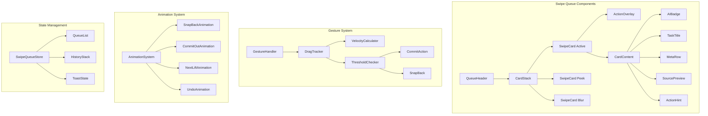

# Design Document: Swipe Queue Enhancement

## Overview

This design transforms the existing Swipe Queue from a basic swipe interface into a premium "Decision Mode" experience. The core philosophy is that Queue ≠ Todo list; Queue = Decision Inbox. Users should make quick decisions (under 3 seconds per card) with minimal cognitive load.

The design follows these principles:
1. **Decision Mode**: UI optimized for quick decisions, not task execution
2. **Swipe = Commit Action**: Clear, meaningful swipe gestures with immediate feedback
3. **One Card = One Thought**: Minimal information per card to reduce cognitive load

## Architecture



## Components and Interfaces

### QueueHeader Component

```typescript
interface QueueHeaderProps {
  title?: string;           // Default: "Review Queue"
  subtitle?: string;        // Default: "Swipe to accept or skip tasks"
  taskCount?: number;       // Optional: show remaining count
}
```

Minimal header with H3 title (16-18px), subtle subtext, no heavy backgrounds.

### CardStack Component

```typescript
interface CardStackProps {
  cards: QueueTask[];
  onAccept: (taskId: string) => void;
  onSkip: (taskId: string) => void;
  onUndo: () => void;
}

interface CardStackState {
  activeIndex: number;
  isAnimating: boolean;
  lastAction: { taskId: string; action: 'accept' | 'skip' } | null;
}
```

Renders up to 3 visible cards with depth effect:
- Card 1 (active): scale 1.0, translateY 0, opacity 1.0, z-index 30
- Card 2 (peek): scale 0.96, translateY 12px, opacity 0.9, z-index 20
- Card 3 (blur): scale 0.92, translateY 24px, blur optional, z-index 10

### SwipeCard Component

```typescript
interface SwipeCardProps {
  task: QueueTask;
  position: 'active' | 'peek' | 'blur';
  onSwipeComplete: (direction: 'left' | 'right') => void;
  reducedMotion?: boolean;
}

interface SwipeCardState {
  dragX: number;
  dragY: number;
  isDragging: boolean;
  velocity: { x: number; y: number };
}
```

### CardContent Component

```typescript
interface CardContentProps {
  task: QueueTask;
}

// Content order (top to bottom):
// 1. AIBadge - "✨ AI detected task" + source
// 2. TaskTitle - 18px semibold, max 2 lines
// 3. MetaRow - assignee, due date, priority with icons
// 4. SourcePreview - 2 lines max, neutral background
// 5. ActionHint - "← Skip    Accept →"
```

### ActionOverlay Component

```typescript
interface ActionOverlayProps {
  direction: 'left' | 'right' | null;
  progress: number;  // 0 to 1
  isCommitted: boolean;
}

// Colors:
// Accept (right): --color-success-soft (green-100/green-200)
// Skip (left): --color-danger-soft (red-100 or gray-200)
```

### GestureHandler

```typescript
interface GestureConfig {
  commitDistanceRatio: number;    // 0.28
  commitDistanceMax: number;      // 160px
  flickVelocityThreshold: number; // 900px/s
  flickDistanceRatio: number;     // 0.12
  maxRotation: number;            // 8deg
}

interface GestureState {
  startX: number;
  startY: number;
  currentX: number;
  currentY: number;
  startTime: number;
  velocityX: number;
}

// Commit distance formula:
// commitDistance = min(0.28 * cardWidth, 160)

// Rotation formula:
// rotation = clamp(dragX / 20, -8, 8)

// Overlay progress formula:
// progress = easeOut(clamp(|dragX| / commitDistance, 0, 1))
```

### AnimationConfig

```typescript
interface AnimationConfig {
  snapBack: {
    duration: 200,
    easing: 'cubic-bezier(0.22, 1, 0.36, 1)'  // easeOutCubic
  };
  commitOut: {
    duration: 260,
    easing: 'cubic-bezier(0.55, 0.06, 0.68, 0.19)'  // easeInCubic
  };
  nextLift: {
    delay: 80,
    duration: 240,
    easing: 'cubic-bezier(0.22, 1, 0.36, 1)'  // easeOutCubic
  };
  undo: {
    duration: 290,
    easing: 'cubic-bezier(0.34, 1.56, 0.64, 1)'  // easeOutBack
  };
  iconPop: {
    duration: 80,
    scale: 1.06
  };
}

// Reduced motion config:
interface ReducedMotionConfig {
  snapBack: { duration: 140, easing: 'ease-out' };
  commitOut: { duration: 140, easing: 'ease-out' };
  nextLift: { delay: 40, duration: 140, easing: 'ease-out' };
  undo: { duration: 160, easing: 'ease-out' };
  disableRotation: true;
}
```

## Data Models

### QueueTask

```typescript
interface QueueTask {
  id: string;
  title: string;
  source: {
    type: 'google_chat' | 'email' | 'manual';
    name: string;           // e.g., "Google Chat"
    spaceName?: string;     // e.g., "Project Alpha"
    preview?: string;       // Original message snippet (max 2 lines)
  };
  meta: {
    assignee?: {
      name: string;
      avatar?: string;
    };
    dueDate?: Date;
    priority?: 'low' | 'medium' | 'high' | 'urgent';
  };
  isAIDetected: boolean;
  createdAt: Date;
}
```

### SwipeQueueState

```typescript
interface SwipeQueueState {
  queue: QueueTask[];
  history: SwipeAction[];
  currentIndex: number;
  isProcessing: boolean;
}

interface SwipeAction {
  taskId: string;
  action: 'accept' | 'skip';
  timestamp: Date;
  canUndo: boolean;
}
```

### ToastState

```typescript
interface ToastState {
  visible: boolean;
  message: string;
  action?: {
    label: string;
    onClick: () => void;
  };
  autoHideMs: number;  // 5000ms
}
```

## Correctness Properties

*A property is a characteristic or behavior that should hold true across all valid executions of a system—essentially, a formal statement about what the system should do. Properties serve as the bridge between human-readable specifications and machine-verifiable correctness guarantees.*

### Property 1: Card Stack Visibility Limit

*For any* queue with N tasks where N > 0, the CardStack SHALL render at most 3 visible cards regardless of queue size.

**Validates: Requirements 1.2**

### Property 2: No Checkbox in Queue Cards

*For any* SwipeCard rendered in the queue, the card SHALL NOT contain any checkbox input elements.

**Validates: Requirements 2.7**

### Property 3: Drag Position 1:1 Mapping

*For any* drag gesture with deltaX pixels, the SwipeCard's translateX SHALL equal deltaX (1:1 mapping on x-axis).

**Validates: Requirements 3.1**

### Property 4: Rotation Formula Correctness

*For any* drag position dragX, the SwipeCard rotation SHALL equal clamp(dragX / 20, -8, 8) degrees.

**Validates: Requirements 3.2**

### Property 5: Overlay Opacity Formula

*For any* drag position dragX and commitDistance, the overlay opacity SHALL follow easeOut(clamp(|dragX| / commitDistance, 0, 1)).

**Validates: Requirements 4.3**

### Property 6: Commit Distance Calculation

*For any* card with width W, the commitDistance SHALL equal min(0.28 * W, 160).

**Validates: Requirements 3.3**

### Property 7: Swipe Commit Logic

*For any* swipe gesture:
- IF |dragX| >= commitDistance THEN action SHALL be triggered
- IF |velocityX| > 900 AND |dragX| >= 0.12 * cardWidth THEN action SHALL be triggered immediately
- IF neither condition is met THEN card SHALL snap back to origin

**Validates: Requirements 3.4, 3.5, 3.6**

### Property 8: Action State Changes

*For any* committed accept action on task T, T SHALL be added to the todo list.
*For any* committed skip action on task T, T SHALL be archived/dismissed from the queue.

**Validates: Requirements 4.4, 5.3**

### Property 9: Undo Round-Trip

*For any* action (accept or skip) followed by an undo, the task SHALL be restored to its previous queue position and state.

**Validates: Requirements 7.4**

### Property 10: Completion Summary Accuracy

*For any* sequence of N accept actions and M skip actions, the completion summary SHALL display exactly N accepted and M skipped.

**Validates: Requirements 8.4**

## Error Handling

### Gesture Errors

1. **Interrupted Drag**: If pointer leaves viewport during drag, snap back to origin
2. **Multi-touch**: Ignore additional touch points, use first touch only
3. **Rapid Swipes**: Disable interaction during commit animation (260ms lock)

### State Errors

1. **Empty Queue**: Display empty state with "Back to Todo" CTA
2. **Undo Timeout**: Undo only available for 5 seconds after action
3. **Network Failure**: Queue actions locally, sync when connection restored

### Animation Errors

1. **Animation Interruption**: Cancel current animation before starting new one
2. **Reduced Motion**: Check `prefers-reduced-motion` and apply simplified animations

## Testing Strategy

### Unit Tests

Unit tests verify specific examples and edge cases:

1. **CardContent rendering**: Verify correct element order and content
2. **Empty state display**: Verify empty queue shows correct message
3. **Toast timing**: Verify toast appears after 120ms and dismisses after 5s
4. **Accessibility**: Verify keyboard navigation works
5. **Reduced motion**: Verify animations are simplified when preference is set

### Property-Based Tests

Property-based tests verify universal properties across all inputs using fast-check:

1. **Card stack limit**: Generate queues of various sizes, verify max 3 visible
2. **No checkbox**: Generate various tasks, verify no checkbox in rendered cards
3. **Drag mapping**: Generate random drag deltas, verify 1:1 x-axis mapping
4. **Rotation formula**: Generate random dragX values, verify rotation calculation
5. **Overlay opacity**: Generate random drag positions, verify opacity formula
6. **Commit distance**: Generate random card widths, verify distance calculation
7. **Commit logic**: Generate swipe gestures with various distances/velocities
8. **State changes**: Generate accept/skip sequences, verify state mutations
9. **Undo round-trip**: Generate action + undo sequences, verify restoration
10. **Summary accuracy**: Generate action sequences, verify counts

### Test Configuration

```typescript
// Property test configuration
const PBT_CONFIG = {
  numRuns: 100,
  seed: Date.now(),
  verbose: true
};

// Test annotation format:
// **Feature: swipe-queue-enhancement, Property N: [property_text]**
// **Validates: Requirements X.Y**
```

### Testing Framework

- Unit tests: Jest + React Testing Library
- Property tests: fast-check
- E2E tests: Playwright (optional, for gesture testing)
